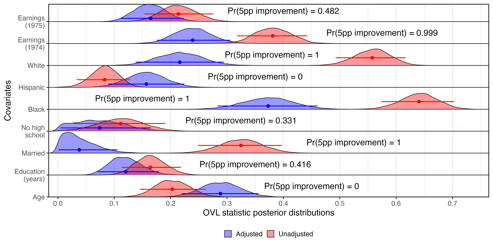

# Bayesian Bootstrap Covariate Balance Falsification Framework for Observational Studies



An R implementation for evaluating covariate balance using Bayesian bootstrap posterior distributions. Designed for matching, weighting, and natural experiment settings in quantitative social science.

## Overview

This framework moves beyond point-estimate balance metrics by constructing non-parametric posterior distributions over multi-moment balance statistics—specifically Overlapping Coefficient (OVL), Variance Ratio (VR), and Kolmogorov-Smirnov (KS) statistics via `cobalt::bal.tab`.

## Features

- **Single-Pass Parallelization**: High-performance execution via `bayesboot`.
- **Full Factor Handling**: Native support for expanded categorical factors (e.g., race, indicators).
- **Publication-Ready Visualization**: Integrated `ggplot2` and `ggridges` density plots overlaid with posterior means, 95% CIs, and posterior probability metrics.

## Requirements

```r
install.packages(c("bayesboot", "cobalt", "MatchIt", "tidyverse", "ggridges"))
```

## Quick Start

Run the following in your R session to download the script into your working directory and open it for editing:

```r
download.file("https://raw.githubusercontent.com/jjharden/bayes_balance/main/bayes_balance.R", destfile = "bayes_balance.R")
file.edit("bayes_balance.R")
```

## Citation

If you use this code, please cite the accompanying paper:

> Harden, Jeffrey J. 2026. "A Falsification Framework for Investigating Observed Covariate Balance." Forthcoming, *Observational Studies*. 
> 
> [**Read the preprint here**](https://jharden.nd.edu/assets/658592/balance.pdf).
